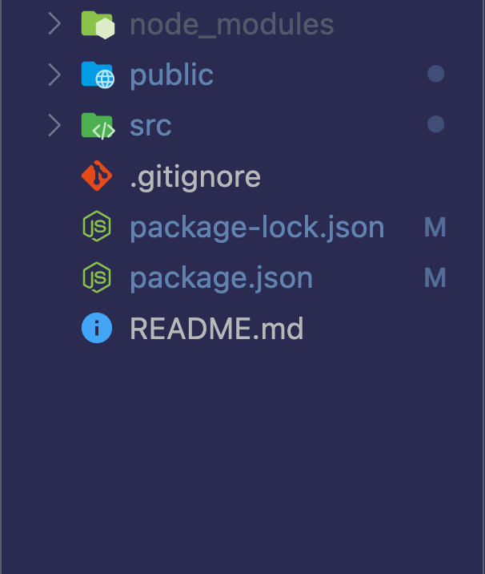

# React.js
### A JavaScript library for building user interfaces.

---
##### _**Create React App**_
```javascript
npx create-react-app my-app
cd my-app
npm start
```
---
_*Important Points*_
1. our folder sctructure will look like this 



2. when we run `npm start` , then start script runs in package.json file .
```javascript
"scripts": {
    "start": "react-scripts start",
    "build": "react-scripts build",
    "test": "react-scripts test",
    "eject": "react-scripts eject"
  }
```


